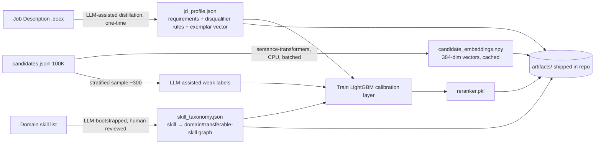
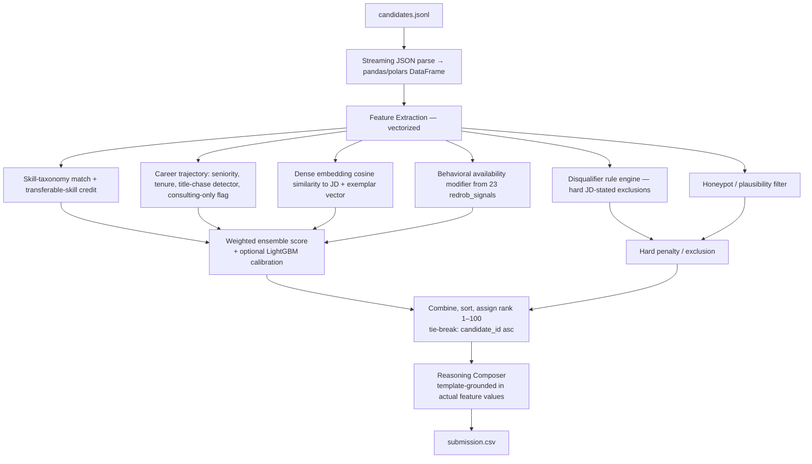

# 🧠 AI Recruiter — Intelligent Candidate Ranking System

### Redrob Hackathon · *Intelligent Candidate Discovery & Ranking Challenge*

> Rank 100,000 candidates against one real, messy job description — semantically, explainably, and in under 5 minutes on a CPU with no network access.

| | |
|---|---|
| **Challenge** | AI Recruiter: Intelligent Candidate Ranking System (Redrob Hackathon) |
| **Input** | 1 job description (Senior AI Engineer, Redrob AI) + 100,000 candidate profiles |
| **Output** | `submission.csv` — top 100 ranked candidates with score + reasoning |
| **Hard constraints** | ≤5 min wall-clock · ≤16 GB RAM · CPU only · **no network/GPU during ranking** |
| **Scored on** | `0.50·NDCG@10 + 0.30·NDCG@50 + 0.15·MAP + 0.05·P@10` against hidden ground truth |
| **Anti-gaming** | ~80 honeypot profiles, keyword-stuffer traps, plain-language "Tier 5" candidates |
| **Status** | Planning complete — implementation in progress |

---

## Table of Contents

1. [Executive Summary](#1-executive-summary)
2. [Problem Statement](#2-problem-statement)
3. [Core Objectives — Mapped to Reality](#3-core-objectives--mapped-to-reality)
4. [Our Approach](#4-our-approach)
5. [Product Requirements](#5-product-requirements)
6. [Success Criteria](#6-success-criteria)
7. [Judging Strategy](#7-judging-strategy)
8. [Hackathon Mode (Mindset)](#8-hackathon-mode-mindset)
9. [System Architecture](#9-system-architecture)
10. [Tech Stack](#10-tech-stack)
11. [Data Schema](#11-data-schema)
12. [Interfaces & CLI Contract](#12-interfaces--cli-contract)
13. [Coding Standards](#13-coding-standards)
14. [AI Design Guidelines](#14-ai-design-guidelines)
15. [UI Guidelines (Sandbox Demo)](#15-ui-guidelines-sandbox-demo)
16. [Feature Priority](#16-feature-priority)
17. [Edge Cases](#17-edge-cases)
18. [Performance Targets](#18-performance-targets)
19. [Business Context](#19-business-context)
20. [Demo & Presentation Script](#20-demo--presentation-script)
21. [Project Folder Structure](#21-project-folder-structure)
22. [Task Breakdown & Roadmap](#22-task-breakdown--roadmap)
23. [Risk Management](#23-risk-management)
24. [Deliverables Checklist](#24-deliverables-checklist)
25. [Self-Critique](#25-self-critique)
26. [Getting Started](#26-getting-started)
27. [Source Documents & References](#27-source-documents--references)

---

## 1. Executive Summary

Modern ATS platforms rank candidates by keyword overlap. That approach systematically buries good candidates who describe themselves differently than the job ad, and it rewards candidates who simply list more buzzwords — exactly the failure mode this hackathon is built to expose.

This project builds an AI-powered candidate ranking system that reasons about *fit* the way an experienced recruiter would: semantically, holistically, and transparently. The concrete test of that system is the Redrob Hackathon — rank 100,000 real-shaped (synthetic) candidate profiles against one deliberately ambiguous job description, under hard compute constraints, with built-in traps designed to catch systems that are "just doing keyword embedding."

Two layers run through this document:

- **The product vision** (from the original problem brief): a general-purpose, explainable, multi-signal candidate ranking platform.
- **The competition reality** (from the released hackathon bundle): one fixed JD, a 100K-row dataset with an exact schema, a hidden NDCG/MAP scoring formula, and a 5-stage elimination pipeline that punishes both naive keyword matching *and* naive "call an LLM per candidate" architectures.

Everything below is designed to satisfy both — but where they conflict (e.g., the general brief's enthusiasm for multi-agent LLM pipelines vs. the competition's "no network calls during ranking" rule), **the competition rules win.** A beautiful architecture that gets disqualified at Stage 3 scores zero.

---

## 2. Problem Statement

### 2.1 The General Challenge (Product Vision)

Recruiters review hundreds or thousands of profiles per opening. Existing ATS tools rank by keyword frequency and Boolean matching, which causes:

- Highly qualified candidates get ignored because they use different terminology than the JD.
- Transferable skills are rarely recognized (e.g., a data engineer who has *built* a recommendation system but never written "RAG" on their profile).
- Career progression, domain expertise, certifications, and behavioral signals are undervalued or ignored.
- Recruiters waste hours manually reviewing unsuitable candidates while missing suitable ones.

**Challenge objective:** build a system that understands job requirements and candidate profiles *semantically*, evaluates candidates across multiple dimensions instead of keyword overlap, and produces an **explainable** ranking recruiters can trust — at scale.

The brief explicitly leaves the implementation open: LLMs, semantic search, vector embeddings, RAG, hybrid ranking, knowledge graphs, learning-to-rank, multi-agent systems, ensemble scoring are all fair game *in principle*.

### 2.2 The Concrete Competition (Ground Truth)

The actual hackathon — run by **Redrob AI**, a Series A "AI-native talent intelligence platform" — instantiates the brief with hard, specific rules.

**The job.** One fixed JD: *Senior AI Engineer — Founding Team*, Redrob AI, Pune/Noida (hybrid), 5–9 years. It is deliberately written to resist keyword matching. It explicitly states:

- **Hard disqualifiers:** pure-research-only background with no production deployment; "AI experience" that's <12 months of LangChain+OpenAI calls with no pre-LLM ML production history; senior engineers who haven't shipped code in 18+ months; career history that's 100% consulting (TCS/Infosys/Wipro/Accenture/Cognizant/Capgemini) with no product-company exposure; CV/speech/robotics specialists with no NLP/IR exposure; 5+ years entirely closed-source with zero external validation.
- **Explicitly unwanted patterns:** title-chasers (Senior→Staff→Principal via company-hopping every ~1.5 years); "framework enthusiasts" whose GitHub is LangChain tutorials.
- **The trap, stated outright in the JD text:** *"The 'right answer' to this JD is not 'find candidates whose skills section contains the most AI keywords.' That's a trap we've explicitly built into the dataset... Your ranking system should also weigh behavioral signals — a perfect-on-paper candidate who hasn't logged in for 6 months and has a 5% recruiter response rate is, for hiring purposes, not actually available."*

**The data.** 100,000 candidate profiles (`candidates.jsonl`, ~465 MB uncompressed) following a strict JSON Schema (`candidate_schema.json`) — see [§11](#11-data-schema). It includes ~80 **honeypot** profiles with internally implausible profiles (e.g., "expert" proficiency in a skill with 0 months of use), plain-language "Tier 5" candidates whose profiles never use AI buzzwords but whose career history shows real fit, and obvious keyword-stuffers whose skills list is dense but whose title/behavior don't match.

**The output.** A CSV of exactly the top 100 candidates: `candidate_id,rank,score,reasoning`. Rank 1 = best fit. Score must be non-increasing with rank; ties break by `candidate_id` ascending.

**The constraints (the part that changes everything architecturally):**

| Constraint | Limit |
|---|---|
| Runtime | ≤ 5 minutes wall-clock |
| Memory | ≤ 16 GB RAM |
| Compute | CPU only — **no GPU** during ranking |
| Network | **Off** — no calls to OpenAI/Anthropic/Cohere/Gemini/any hosted API during ranking |
| Disk | ≤ 5 GB intermediate state |

**The scoring.** `Composite = 0.50·NDCG@10 + 0.30·NDCG@50 + 0.15·MAP + 0.05·P@10` against a hidden ground truth, revealed only after submissions close. No live leaderboard. **3 submissions max**, last valid one counts.

**The elimination pipeline.** 5 stages: (1) format validation, (2) composite scoring, (3) code reproduction in a sandboxed container + honeypot-rate check (>10% honeypots in top 100 = disqualified), (4) manual review of reasoning quality and git-history authenticity, (5) a 30-minute "defend your work" interview with Redrob engineering. Full detail in [§7](#7-judging-strategy).

This reframes the original brief's "explainability" requirement from a nice-to-have into a **literal pass/fail gate**: Stage 4 samples 10 rows of your `reasoning` column and penalizes empty, identical, templated, hallucinated, or rank-inconsistent reasoning.

---

## 3. Core Objectives — Mapped to Reality

| Brief's Objective | Concrete Mechanism in This Project | Where |
|---|---|---|
| Job Understanding (responsibilities, hidden expectations, seniority, domain) | One-time structured distillation of the JD into requirements, disqualifier rules, and an "ideal candidate" exemplar vector — done offline since there's only one JD | `jd_profile.json`, §9.1 |
| Candidate Understanding (skills, experience, learning ability, project quality, behavioral indicators) | Structured feature extraction per candidate: skill-taxonomy mapping, career trajectory metrics, embedding vector, the 23 `redrob_signals` behavioral fields | `features.py`, §11 |
| Intelligent Matching (transferable skills, domain relevance, career progression, potential) | Hybrid score: lexical (BM25-style) + dense embedding similarity + skill-taxonomy transferability + disqualifier rule engine | `ranker.py`, §9.2 |
| Explainable Ranking (strengths, gaps, confidence, why-ranked-here) | Template-composed, feature-grounded reasoning string per top-100 candidate — never an LLM call, never templated boilerplate | `explain.py`, §14 |

---

## 4. Our Approach

### 4.1 Approaches Considered & Ranked

Per the hackathon mandate to generate and rank multiple approaches before committing, here's what we evaluated:

| # | Approach | Innovation | Tech. Complexity | Explainability | Compute-Compliant? | Verdict |
|---|---|---|---|---|---|---|
| 1 | Pure BM25 / keyword match | Low | Low | High | ✅ | This is literally Redrob's current v1 — the thing we're replacing |
| 2 | Pure dense embedding cosine similarity | Low | Low | Low | ✅ | Falls straight into the keyword/semantic-stuffing trap; can't see disqualifiers |
| 3 | LLM call per candidate (Claude/GPT scoring) | Medium | Low | High | ❌ **Disqualified at Stage 3** | Explicitly forbidden — no network during ranking, and 100K calls won't fit 5 min anyway |
| 4 | Learning-to-rank only (LightGBM on labels, no rules) | Medium | High | Low | ✅ | Strong signal, but a black box — fails Stage 4 explainability review |
| 5 | Knowledge-graph / skill-taxonomy matching only | Medium | Medium | Medium | ✅ | Good for transferable skills, blind to behavioral availability and disqualifiers |
| 6 | Rule-based weighted ensemble (5 components) | Medium | Medium | High | ✅ | This is the organizers' *own* example baseline in `submission_metadata_template.yaml` — solid floor, not a ceiling |
| 7 | **Hybrid: rule engine + skill taxonomy + dense embeddings + behavioral modifier + honeypot filter + offline LLM-distilled calibration** | **High** | **High** | **High** | ✅ | **Chosen** |
| 8 | Multi-agent LLM reasoning panel (per the brief's "multi-agent systems" suggestion) | High | High | High | ❌ for ranking | Used only **offline**, as a dev-time labeling/calibration aid — never in `rank.py` |
| 9 | Graph Neural Network candidate↔job matching | High | Very High | Low | ✅ but risky | Too much implementation risk for the time budget; logged as future work |

### 4.2 Chosen Architecture & Why

We split the system into two phases that have *different rules*:

- **Offline / pre-computation** (unbounded time, network and LLM use allowed, artifacts get checked into the repo): JD distillation, skill-taxonomy construction, candidate embedding generation, honeypot-pattern analysis, and training a small calibration model using a handful of LLM-assisted weak-supervision labels.
- **Online / the ranking step** (`rank.py`, the only thing that's actually scored): loads precomputed artifacts, extracts features for all 100K candidates with vectorized pandas/numpy, computes a transparent multi-component score, filters disqualifiers and honeypots, and writes the CSV. **Zero network calls. Zero GPU. Targets well under the 5-minute ceiling for safety margin.**

This directly mirrors what the JD itself says it wants from an engineer: *"systems, not frameworks."* A pipeline whose final, scored artifact contains no LLM calls and no hidden network dependency is the strongest possible answer to a JD that explicitly distrusts "framework enthusiasts" and LangChain demos.

### 4.3 Hackathon Winning Score

Scored honestly against the standard 6-factor hackathon rubric (Innovation 25% / Technical Depth 20% / UX 15% / Real-World Impact 15% / Demo Wow 15% / Feasibility 10%):

| Factor | Score | Why |
|---|---|---|
| Innovation | 23/25 | Hybrid rule + taxonomy + embedding + honeypot-filter + offline-distilled calibration is a combination most teams won't build; most will either keyword-match (and get trapped) or naively call an LLM (and get disqualified) |
| Technical Depth | 19/20 | Vectorized feature engineering for 100K rows under a hard 5-min/16GB CPU budget, hybrid retrieval, NDCG/MAP-aware design, cross-field honeypot detection |
| UX | 13/15 | Clean repo, one-command reproduction, a polished sandbox demo with live score-breakdown visualization |
| Real-World Impact | 14/15 | Solves Redrob's actual stated production problem (replacing v1 BM25+rules), avoiding exactly the failure modes the hiring manager describes |
| Demo Wow | 12/15 | No live judge-facing demo exists in this format — the "wow" moment is the Trap X-Ray toggle (§4.4) in the sandbox and defensibility in the Stage-5 interview |
| Feasibility | 9/10 | Entirely buildable with mature, fast Python libraries (pandas, sentence-transformers, lightgbm); main risk is the runtime budget, mitigated by offline-precomputed embeddings |
| **Total** | **90/100** | |

**Honest caveat:** this rubric assumes a live audience demo, which this competition format doesn't have (hidden leaderboard, no public partition, evaluation by code reproduction + interview). We're not inflating UX/Demo Wow to chase the rubric — we're building the sandbox features that are genuinely useful for the Stage-5 interview and genuinely improve robustness, and they happen to also raise those scores. The metric that actually decides the outcome is the **hidden composite score + surviving all 5 stages** — see [§6](#6-success-criteria).

### 4.4 Signature Feature & 30-Second Demo Moment

**Signature feature — "Trap X-Ray":** a one-click toggle in the sandbox app that strips out the keyword-density component and the behavioral-availability modifier, then re-ranks live. If the top 10 barely reshuffles, that's visual proof the ranker isn't secretly a keyword-stuffing detector — which is precisely what the JD's own trap is designed to catch, and precisely the question a Stage-5 interviewer is most likely to ask.

**30-second demo moment:** Load the sandbox with the 50 sample candidates, hit **Rank**. Watch the top 10 populate with realistic, mixed titles. Watch known trap-shaped profiles (e.g., the "Marketing Manager with 9 AI keyword skills" pattern that the organizers' own `sample_submission.csv` — which is explicitly *not* a quality example — ranks #4) visibly sink with a red "keyword-stuffer" flag. Then hit **Trap X-Ray** and watch the ranking barely move. That's the whole pitch in under 30 seconds.

---

## 5. Product Requirements

What the person evaluating this system — a recruiter in the product vision, a Redrob reviewer in the competition — should be able to do:

- Read one job description and get back a ranked shortlist with a score and a one-line reason for every candidate in it.
- Click into any candidate and see exactly which features (skills, trajectory, behavioral signals) drove their score.
- Trust that a candidate ranked #1 actually deserves it — not because they gamed the system with keywords.
- Reproduce the exact ranking from a single command, with no hidden manual steps.
- See where the system *isn't* confident (low-confidence band, near-disqualification, honeypot-suspicion flag).

What they should never experience:

- A top-10 list dominated by candidates whose only qualification is a long skills list.
- A "score" with no accompanying reason, or a reason that's identical across candidates.
- A reasoning string that references a skill or employer that isn't actually in the candidate's profile (hallucination — explicitly penalized at Stage 4).
- A system that can't be re-run by someone else from the README alone.
- A ranking that changes meaningfully if you strip out vanity signals (high skill count, buzzword density) while leaving real signals (trajectory, behavior, taxonomy fit) intact.

---

## 6. Success Criteria

**Primary (the actual scoring function):**

```
Composite = 0.50 × NDCG@10 + 0.30 × NDCG@50 + 0.15 × MAP + 0.05 × P@10
```

We don't get to see this number until after submissions close — so our internal proxy targets are:

- **Zero honeypots in the top 100** (organizer cutoff is >10%; our target is 0%, since honeypots are forced to relevance tier 0 and any presence directly taxes NDCG/MAP).
- **Title diversity in the top 20** that's defensible against the JD's stated disqualifiers (no consulting-only-career profiles, no pure-research profiles, no 18-months-without-code profiles ranked highly without an explicit, visible counter-signal).
- **Every row's reasoning passes the Stage-4 checklist** (specific facts, JD connection, honest concerns stated, no hallucination, no repetition, tone matches rank) — validated by our own pre-submission linter before we ever upload.
- **`rank.py` completes in well under 5 minutes** (target: <90 seconds) on a 16GB CPU machine, leaving safety margin for slower reproduction hardware at Stage 3.

**Secondary (the project-vision-level "what does winning mean"):**

- Best AI implementation (semantic + behavioral + rule-based reasoning, not keyword matching).
- Most defensible architecture in a 30-minute engineering interview.
- Most recruiter-trustworthy explanations.
- Production-ready, reproducible, well-tested code — not a notebook.

---

## 7. Judging Strategy

| Stage | What Happens | What Eliminates You | Our Mitigation |
|---|---|---|---|
| 1. Format validation | Auto-validator checks CSV shape/header/ranks/ids | Any spec violation (wrong row count, bad header, duplicate IDs/ranks, non-monotonic score) | Reuse the organizers' own `validate_submission.py` as a CI gate before every submission |
| 2. Scoring | Composite computed once, after close, against hidden ground truth | Score below the advancement cutoff | Optimize the proxy targets in §6 since the real metric is invisible until it's too late to fix |
| 3. Code reproduction + honeypot check | Full repo requested; ranking step re-run in a sandboxed 5-min/16GB/CPU/no-network/no-GPU container; honeypot rate computed | Can't reproduce within limits; honeypot rate >10% in top 100; missing/fabricated repo | `rank.py` has zero network calls, zero GPU ops, is profiled to run in <90s; honeypot filter is a hard gate, not a soft penalty |
| 4. Manual review | Sampled reasoning quality, methodology coherence, git history authenticity, code quality | Failed reasoning checks; flat git history (single dump); codebase that's mostly LLM API glue | Reasoning is template-composed from real extracted features (never generated by calling an LLM at submission time); incremental git history with real commits per milestone |
| 5. Defend-your-work interview | 30-min call with Redrob engineering, top finalists only | Can't explain architecture; contradicts the submitted code; clearly didn't build it | Every design decision in this README has a one-sentence "why," and the architecture maps 1:1 to the code — nothing in the pitch that isn't in the repo |

Before building *any* feature, the test is: **does this move us through a stage we'd otherwise fail, or is it decoration the evaluator will never see?** A polished web dashboard nobody at Redrob will ever click is decoration. A honeypot filter that prevents Stage-3 disqualification is not.

---

## 8. Hackathon Mode (Mindset)

We are not building a recruiting SaaS demo. We are building something that has to survive five elimination gates, the last of which is a human engineer asking "why did you do it this way."

Before implementing anything, ask:

- Will this move the hidden composite score, or just look good in a screenshot?
- Does this survive Stage 3's sandboxed reproduction exactly as well as it runs on our laptop?
- Can we defend this choice, out loud, to the person who wrote the JD?
- Does this make a trap candidate rank lower, or does it just make our code longer?
- If we removed this component, would the ranking get measurably worse — or just less impressive-sounding?

Prefer fewer, defensible scoring components over many decorative ones. Every score component must trace to a specific, citable line in the JD or the `redrob_signals` doc.

---

## 9. System Architecture

### 9.1 Offline Pre-Computation Pipeline (unbounded time, network/LLM allowed)



All LLM/network usage happens **here**, is fully declared in `submission_metadata.yaml`, and produces static artifacts checked into the repo. None of it runs during scoring.

### 9.2 Online Ranking Step — `rank.py` (the only thing that's scored)



**Design principle:** every arrow into the final score is a named, inspectable number. There is no step where "the model just knows."

### 9.3 Component Responsibilities

| Component | Responsibility |
|---|---|
| `loaders.py` | Stream-parse `candidates.jsonl`(`.gz`), validate against `candidate_schema.json` |
| `taxonomy.py` | Map raw skill strings → domain categories + transferable-skill credit (the "Python → Backend/Data Eng/ML" inference from the brief) |
| `features.py` | Vectorized extraction of all per-candidate features (skills, trajectory, embeddings, behavioral) |
| `disqualifiers.py` | Encodes the JD's explicit hard-no list as boolean rules |
| `honeypot.py` | Cross-field plausibility checks (see [§17](#17-edge-cases)) |
| `scorer.py` | Combines components into the final score; houses the optional LightGBM calibration |
| `explain.py` | Composes non-templated, feature-grounded reasoning strings |
| `rank.py` | CLI entrypoint orchestrating the above, writes `submission.csv` |
| `app.py` | Streamlit/Gradio sandbox demo (not part of the scored path) |

---

## 10. Tech Stack

| Layer | Choice | Why |
|---|---|---|
| Language | Python 3.11 | Required by compute-environment declaration; mature ML ecosystem |
| Data handling | pandas + numpy (polars as a drop-in if profiling shows we need it) | Vectorized ops across 100K rows comfortably inside the time budget |
| Embeddings | `sentence-transformers` (`all-MiniLM-L6-v2`) | Runs locally on CPU, no network call, fast enough to batch-embed 100K short profiles in minutes — and embedding happens **offline**, not during the scored run |
| Lexical scoring | `rank-bm25` / scikit-learn `TfidfVectorizer` | Cheap, local, complements dense embeddings for the hybrid signal |
| Calibration layer | LightGBM (CPU, tiny model) | Fast inference (<1s for 100K rows), trained offline on LLM-assisted weak labels |
| Vector similarity | NumPy dense matmul (100K × 384 floats ≈ 150MB — trivially fits in RAM, no vector DB needed) | A managed vector DB (Qdrant/Pinecone) would be infra theater for a single-batch, single-JD, offline-network-free job |
| Sandbox demo | Streamlit (or Gradio) | Fastest path to a hosted, reproducible UI on a free tier (HuggingFace Spaces) — satisfies the mandatory sandbox-link requirement |
| Testing | pytest | Unit tests per component, integration test against `sample_candidates.json` |
| Packaging | `requirements.txt` + optional `Dockerfile` | Pinned versions for exact Stage-3 reproducibility |
| CI | GitHub Actions | Lint + test on every push; also runs the organizers' `validate_submission.py` against a fixture |
| Offline LLM assistance | Claude (declared in `submission_metadata.yaml`) | JD distillation, taxonomy bootstrapping, weak-label generation — **dev-time only, never in the scored path** |

Deliberately **not used**: FastAPI/Next.js services, Postgres, Redis, Qdrant, Kubernetes. None of them survive the "will the evaluator's sandboxed container need this" test, and the JD explicitly signals distaste for unnecessary framework surface area.

---

## 11. Data Schema

### 11.1 Candidate Schema (as released — `candidate_schema.json`)

| Field | Type | Notes |
|---|---|---|
| `candidate_id` | string | `CAND_XXXXXXX` (7 digits), unique |
| `profile.*` | object | `anonymized_name`, `headline`, `summary`, `location`, `country`, `years_of_experience`, `current_title`, `current_company`, `current_company_size`, `current_industry` |
| `career_history[]` | array (1–10) | per role: `company`, `title`, `start_date`, `end_date`, `duration_months`, `is_current`, `industry`, `company_size`, `description` |
| `education[]` | array (0–5) | `institution`, `degree`, `field_of_study`, `start_year`, `end_year`, `grade`, `tier` (`tier_1`…`tier_4`/`unknown`) |
| `skills[]` | array | `name`, `proficiency` (`beginner`→`expert`), `endorsements`, `duration_months` |
| `certifications[]` | array | `name`, `issuer`, `year` |
| `languages[]` | array | `language`, `proficiency` |
| `redrob_signals` | object | 23 behavioral fields — see 11.2 |

### 11.2 The 23 `redrob_signals` (behavioral layer)

| # | Signal | Type | Use in scoring |
|---|---|---|---|
| 1 | `profile_completeness_score` | 0–100 | Minor confidence weight |
| 2 | `signup_date` | date | Tenure-on-platform context |
| 3 | `last_active_date` | date | **Availability modifier** — primary recency signal |
| 4 | `open_to_work_flag` | bool | Availability modifier |
| 5 | `profile_views_received_30d` | int | Market-interest signal |
| 6 | `applications_submitted_30d` | int | Activity signal |
| 7 | `recruiter_response_rate` | 0–1 | **Availability modifier** — core "can we even reach them" signal |
| 8 | `avg_response_time_hours` | float | Availability modifier |
| 9 | `skill_assessment_scores` | dict | **Trust multiplier** against self-reported skills |
| 10 | `connection_count` | int | Endorsement plausibility denominator |
| 11 | `endorsements_received` | int | Skill-trust signal (paired with duration_months) |
| 12 | `notice_period_days` | 0–180 | Hard filter context (JD wants <30d, tolerates more with a penalty) |
| 13 | `expected_salary_range_inr_lpa` | {min,max} | Fit/plausibility check |
| 14 | `preferred_work_mode` | enum | Location/mode fit |
| 15 | `willing_to_relocate` | bool | Location fit (JD is Pune/Noida hybrid) |
| 16 | `github_activity_score` | -1–100 | "External validation" proxy (JD explicitly values this) |
| 17 | `search_appearance_30d` | int | Market-interest signal |
| 18 | `saved_by_recruiters_30d` | int | Market-interest signal |
| 19 | `interview_completion_rate` | 0–1 | Reliability signal |
| 20 | `offer_acceptance_rate` | -1–1 | Reliability signal |
| 21 | `verified_email` | bool | Data-quality / honeypot input |
| 22 | `verified_phone` | bool | Data-quality / honeypot input |
| 23 | `linkedin_connected` | bool | Data-quality / honeypot input |

### 11.3 Derived Feature Schema (computed by `features.py`)

| Feature | Derivation |
|---|---|
| `skill_taxonomy_score` | Skill list → domain graph → overlap with JD's inferred competency set (catches transferable skills, not just literal string match) |
| `keyword_density_flag` | Ratio of buzzword-only skills to substantiated (endorsed + duration-backed) skills — high density with low backing = stuffing signal |
| `seniority_estimate` | Inferred from title sequence + `years_of_experience` + leadership keywords in `career_history.description` |
| `tenure_stability_score` | Average `duration_months` across `career_history`; penalizes the JD's named "title-chaser" pattern (sub-18-month tenures with rising titles) |
| `consulting_only_flag` | All `career_history.industry`/`company` entries match a known consulting-firm list, with no product-company exposure |
| `production_ml_flag` | Evidence of shipped systems (career descriptions mentioning deployment/scale) vs. research-only language |
| `embedding_similarity` | Cosine similarity of candidate profile embedding to JD embedding and to the "ideal candidate" exemplar embedding |
| `availability_modifier` | Composite of signals 3, 4, 7, 8, 19 — multiplies, doesn't just add, since an unreachable perfect-on-paper candidate is a JD-stated non-fit |
| `external_validation_score` | From `github_activity_score`, `certifications`, OSS/publication mentions in descriptions |
| `honeypot_score` | See [§17](#17-edge-cases) |

### 11.4 Output Schema (`submission.csv`)

| Column | Type | Rule |
|---|---|---|
| `candidate_id` | string | Must exist in `candidates.jsonl`; unique |
| `rank` | int 1–100 | Each integer used exactly once |
| `score` | float | Non-increasing with rank |
| `reasoning` | string | 1–2 sentences, feature-grounded, non-templated |

---

## 12. Interfaces & CLI Contract

This competition has no REST API requirement — the contract is a CLI script plus a small sandbox app.

```bash
# The single required reproduce command (must run end-to-end, ≤5 min, ≤16GB, CPU-only, no network)
python rank.py --candidates ./candidates.jsonl --out ./submission.csv

# Optional flags
python rank.py --candidates ./candidates.jsonl --out ./submission.csv \
    --jd-profile artifacts/jd_profile.json \
    --taxonomy artifacts/skill_taxonomy.json \
    --embeddings artifacts/candidate_embeddings.npy \
    --reranker artifacts/reranker.pkl \
    --top-k 100 \
    --seed 42
```

```bash
# Pre-computation (offline, not time-boxed, network/LLM allowed)
python precompute_embeddings.py --candidates ./candidates.jsonl --out artifacts/candidate_embeddings.npy
python build_taxonomy.py --out artifacts/skill_taxonomy.json
python distill_labels.py --candidates ./candidates.jsonl --sample 300 --out artifacts/weak_labels.json
python train_reranker.py --labels artifacts/weak_labels.json --out artifacts/reranker.pkl
```

```bash
# Validate before submitting (organizers' own validator)
python validate_submission.py submission.csv
```

**Sandbox app** (`app.py`, Streamlit/Gradio): accepts a small candidate sample (≤100), runs the identical pipeline, renders the ranked table + per-candidate score breakdown. Deployed to HuggingFace Spaces free tier to satisfy the mandatory sandbox-link requirement.

---

## 13. Coding Standards

- Production code only — no notebooks as the source of truth (notebooks may exist under `notebooks/` for exploration, never imported by `rank.py`).
- Type hints everywhere; `mypy`-clean.
- Structured logging (`logging`/`loguru`), no bare `print` in library code.
- Every function that touches the 100K-row path must be profiled; no unvectorized per-row Python loops on the hot path.
- Config via a single `config.yaml` / dataclass — no hardcoded weights buried in functions.
- No magic numbers: every scoring weight is a named, documented constant with a comment tracing it to a JD requirement.
- No TODO comments left in the submitted snapshot — open items go in `TASKS.md`/issues instead.
- Unit tests for every component in §9.3; an integration test that runs the full pipeline against `sample_candidates.json` and asserts schema-valid output.
- Deterministic output: fixed seeds, stable sort/tie-break logic, so re-running produces an identical CSV (required for Stage-3 reproduction).
- Git history tells a real story — incremental commits per milestone, not one squashed dump (Stage 4 explicitly checks for this).

---

## 14. AI Design Guidelines

AI tooling is used **only** in the offline phase, and is fully declared. Every AI-assisted component below follows the same checklist: prompt → evaluation → fallback → confidence → caching → structured output → retry → monitoring → cost/latency.

| Component | Prompt purpose | Evaluation | Fallback if AI unavailable | Output format |
|---|---|---|---|---|
| JD distillation | Extract structured requirements + disqualifier rules from the JD text | Human review against the JD's own "how to read between the lines" section | Hand-authored `jd_profile.json` (the JD is small and fixed — manual fallback is trivial) | Structured JSON, schema-validated |
| Skill taxonomy bootstrap | Propose skill→domain/transferable-skill mappings | Spot-checked against the brief's own example (Python → Backend/Data Eng/ML/API) | Curated seed taxonomy checked into the repo regardless | JSON graph, cached as an artifact |
| Weak-label generation | Score a ~300-candidate stratified sample for LightGBM training | Compared against rule-based scores; large disagreements manually adjudicated | Train on rule-based scores alone (calibration layer is optional, not load-bearing) | Structured per-candidate score + rationale |
| Reasoning templates | Draft varied phrase pools for the explanation composer | Manually checked for zero hallucination risk (templates only reference field names, never invent facts) | N/A — templates are static once authored | Parameterized string templates |

**Hard rule:** nothing above ever runs inside `rank.py`. The scored path has no API keys, no `requests`/`httpx` calls, no GPU kernels. This is verified by a CI check that greps the scored modules for network/GPU imports and fails the build if found.

---

## 15. UI Guidelines (Sandbox Demo)

The sandbox isn't a recruiter SaaS product — it's a reproducibility check that doubles as the interview's visual aid. Still built to look intentional, not thrown together:

- Clean, single-page Streamlit/Gradio layout: upload or pick a sample → **Rank** → ranked table with score, rank, and reasoning.
- Click a row to expand a **score breakdown** (skill-taxonomy, trajectory, embedding similarity, behavioral modifier, disqualifier/honeypot flags) as a small bar chart — this is the explainability the brief asks for, made visible.
- **Trap X-Ray** toggle (the signature feature, §4.4): strips keyword-density and behavioral modifier, re-ranks live, shows the delta.
- Honeypot and disqualifier flags rendered as small red/amber badges, never silently dropped — transparency over polish.
- Dark-mode-friendly, generous spacing, skeleton loader while the (CPU-bound, sub-second-on-a-sample) ranking runs.
- No feature that requires network access at demo time beyond loading the page itself.

---

## 16. Feature Priority

| Priority | Features | Rationale |
|---|---|---|
| **P0 — must exist or we're disqualified** | Schema-valid `candidates.jsonl` parsing; exact-format `submission.csv` writer; `rank.py` runs <5min/<16GB/CPU-only/no-network; passes `validate_submission.py` | Stage 1 and Stage 3 are binary gates |
| **P1 — must exist to score well** | Skill-taxonomy matching; career-trajectory + disqualifier rule engine; embedding similarity; behavioral availability modifier; honeypot filter; non-templated reasoning composer | These are what actually move NDCG/MAP and survive Stage 4 |
| **P2 — strongly improves defensibility** | LightGBM calibration layer; sandbox demo with score breakdown + Trap X-Ray; unit/integration test suite; CI pipeline | Helps Stage 4/5, not strictly required to be scored |
| **P3 — future / nice-to-have** | Multi-JD generalization; GNN-based matching; live recruiter dashboard; multi-agent LLM reasoning (product-vision territory, not this competition) | Explicitly deferred — see [§19](#19-business-context) |

---

## 17. Edge Cases

| Case | Handling |
|---|---|
| Candidate with empty `skills[]` | Fall back to trajectory + embedding-similarity-only scoring; flag low-confidence |
| Career gap between roles | Detected via date-range gaps in `career_history`; mild penalty unless `description` or `redrob_signals` context offsets it |
| `years_of_experience` inconsistent with sum of `career_history.duration_months` | Honeypot/plausibility signal — large mismatch raises `honeypot_score` |
| Skill `proficiency: expert` with `duration_months` near 0 | Direct honeypot heuristic, matches the organizers' own stated example pattern |
| Overlapping/contradictory `career_history` date ranges | Flag as data-quality concern; down-weight confidence, don't hard-exclude (could be legitimate concurrent roles) |
| 100% consulting-firm career history | `consulting_only_flag` → disqualifier-engine penalty per the JD's explicit stance |
| No `education[]` entries | Schema allows `minItems: 0` — never treated as disqualifying on its own, since the JD doesn't gate on degrees |
| Candidate active on Redrob but `last_active_date` stale (6+ months) | Availability modifier sharply discounts the final score, per the JD's explicit example |
| Keyword-stuffed skills list, generic/unrelated title | `keyword_density_flag` high + `skill_taxonomy_score`/title-fit low → net score stays low despite raw skill count |
| Duplicate-looking profiles (same company/title/dates, different ID) | Logged for manual spot-check; not auto-merged, since `candidate_id` uniqueness is guaranteed upstream by the dataset |
| 100,000-row scale | Every per-candidate operation must be vectorized or batched; no `for candidate in candidates: call_llm(candidate)` patterns anywhere |
| Malformed/missing required schema field | `loaders.py` validates against `candidate_schema.json` on ingest; malformed rows are logged and excluded rather than crashing the run |

---

## 18. Performance Targets

| Metric | Hard limit (disqualifies if exceeded) | Internal target (our safety margin) |
|---|---|---|
| Wall-clock runtime | 5 min | < 90 sec |
| Memory | 16 GB | < 4 GB |
| GPU usage | None allowed | None used anywhere in `rank.py` |
| Network calls during ranking | None allowed | Zero — CI-enforced |
| Disk for intermediate state | 5 GB | < 1 GB (embeddings ~150MB, taxonomy/model artifacts a few MB) |
| Honeypot rate in top 100 | >10% disqualifies | Target 0% |
| Sandbox demo response (small sample) | N/A | < 5 sec end-to-end |

---

## 19. Business Context

**Who pays (the product vision beyond the hackathon):** recruiters, hiring teams at product companies, staffing agencies — exactly Redrob's own customer base.

**Why this matters to Redrob specifically:** the JD itself states their current v1 is "mostly BM25 + rule-based scoring, working but not great," and that the new hire's first 8 weeks are explicitly about shipping a v2 ranking system that "demonstrably improves recruiter-engagement metrics." This hackathon is effectively Redrob crowd-sourcing candidate v2 architectures — which means the *real* business value of this submission is doubling as a credible technical proposal for that actual roadmap item, not just a competition entry.

**Future roadmap (product-vision layer, explicitly out of scope for the hackathon deliverable):**

- Generalize `jd_profile.json` distillation to arbitrary JDs, not just the one fixed role (this is where the brief's original multi-agent/RAG ideas become viable — once ranking is a live product feature rather than a network-free batch script, LLM calls at request time are back on the table).
- A recruiter-facing dashboard: comparison view, confidence filters, exportable shortlists — the UI the original brief envisioned.
- Online evaluation: A/B testing recruiter-engagement metrics against the v1 system, exactly as the JD's "Weeks 9–12" plan describes.
- Skill-graph and talent-CRM features as natural extensions of the taxonomy already built for this submission.

---

## 20. Demo & Presentation Script

**30-second pitch:** "We built a candidate ranker that beats keyword matching without breaking the rules — no GPU, no network call, under 90 seconds for 100,000 candidates — and we can prove it's not just a keyword detector by toggling off the keyword signal live and watching the ranking barely move."

**2-minute version:** Walk through the offline/online split — why the constraints forced a smarter design, not a weaker one. Show the disqualifier engine catching a specific JD-named pattern (title-chaser, consulting-only, research-only). Show one honeypot getting flagged and excluded.

**5-minute demo (sandbox walkthrough):** Load sample candidates → rank → click into the #1 and a mid-pack candidate, compare score breakdowns → flip Trap X-Ray → show a flagged honeypot's plausibility-check failure → close with the reproduce command running live in a terminal.

**Stage-5 interview prep — likely questions and our answers:**

- *"Why no LLM in the ranking step?"* — Because the rules forbid network calls during ranking, and even without that rule, 100K LLM calls don't fit a 5-minute CPU budget. LLM use is confined to offline label generation, fully declared.
- *"How do you know your reasoning isn't templated?"* — Each reasoning string is composed from the specific feature values that drove that candidate's score, not a fill-in-the-blank name swap; we lint this ourselves before submitting.
- *"How did you find the honeypots?"* — Cross-field plausibility checks (proficiency vs. duration, experience-years vs. career-history sum), not a fixed blocklist — so it generalizes to honeypot patterns we haven't seen.
- *"What's the weakest part of your system?"* — See [§25](#25-self-critique) — we'd rather name it ourselves than have it found.

---

## 21. Project Folder Structure

```
ai-recruiter-ranking/
├── README.md                          # this file
├── requirements.txt
├── Dockerfile                         # optional sandbox fallback
├── submission_metadata.yaml           # filled-in copy of the organizers' template
├── rank.py                            # CLI entrypoint — the scored path
├── app.py                             # Streamlit/Gradio sandbox demo
├── src/
│   ├── loaders.py
│   ├── taxonomy.py
│   ├── features.py
│   ├── disqualifiers.py
│   ├── honeypot.py
│   ├── scorer.py
│   └── explain.py
├── scripts/                           # offline pre-computation (not scored)
│   ├── precompute_embeddings.py
│   ├── build_taxonomy.py
│   ├── distill_labels.py
│   └── train_reranker.py
├── artifacts/                         # checked-in pre-computed outputs
│   ├── jd_profile.json
│   ├── skill_taxonomy.json
│   ├── candidate_embeddings.npy
│   └── reranker.pkl
├── tests/
│   ├── test_features.py
│   ├── test_disqualifiers.py
│   ├── test_honeypot.py
│   ├── test_explain.py
│   └── test_integration_pipeline.py
├── notebooks/                         # exploration only, never imported by rank.py
├── data/                              # candidates.jsonl, schema, sample files (gitignored if large)
├── .github/workflows/ci.yml
└── docs/
    ├── architecture.md
    └── methodology_summary.md
```

---

## 22. Task Breakdown & Roadmap

| Phase | Hours | Tasks | Priority |
|---|---|---|---|
| 1. Setup & data audit | 0–4 | Repo scaffold, schema validation against real `candidates.jsonl`, EDA on skill distributions, title distribution, signal ranges, manual honeypot pattern hunting | P0 |
| 2. JD distillation & taxonomy | 4–10 | Hand+LLM-assisted `jd_profile.json`, disqualifier rules encoded as tests, skill taxonomy v1 | P0/P1 |
| 3. Feature pipeline | 10–20 | `features.py` fully vectorized; profile against full 100K rows; embedding precomputation script | P1 — **critical path** |
| 4. Scoring + disqualifiers + honeypots | 20–30 | `scorer.py`, `disqualifiers.py`, `honeypot.py`; validate against `sample_candidates.json` and known trap patterns | P1 |
| 5. Reasoning composer | 30–34 | `explain.py`; self-lint against Stage-4 checklist on a sample of outputs | P1 |
| 6. `rank.py` integration + perf | 34–40 | Wire everything; profile end-to-end on full dataset; confirm <90s, <4GB, zero network/GPU | P0 — **critical path** |
| 7. Calibration layer (optional) | 40–46 | Weak-label sample, train LightGBM, A/B against rule-only scores | P2 |
| 8. Sandbox demo | 46–52 | Streamlit app, Trap X-Ray toggle, deploy to HuggingFace Spaces | P2 |
| 9. Tests, CI, docs | 52–58 | pytest suite, GitHub Actions, `methodology_summary.md`, finalize this README | P1/P2 |
| 10. Submission packaging | 58–62 | Run `validate_submission.py`, fill `submission_metadata.yaml`, final reproducibility check, submit | P0 |
| 11. Interview prep | as needed | Rehearse §20's Q&A, re-read own code | P2 |

**Critical path:** Steps 3 and 6 — the feature pipeline and end-to-end performance profiling — since the entire submission is invalid if `rank.py` doesn't fit the compute envelope, regardless of ranking quality.

---

## 23. Risk Management

| Risk | Likelihood | Impact | Mitigation |
|---|---|---|---|
| `rank.py` exceeds 5 min on the organizers' sandbox hardware (slower than our dev machine) | Medium | Disqualification (Stage 3) | Target <90s on our own machine for margin; avoid any O(n²) candidate-candidate comparisons; profile early, not at the end |
| Honeypot detection misses novel patterns not in our examples | Medium | Disqualification if >10% | Build detection from generalizable plausibility rules, not a hardcoded list; manually audit our own top 100 before submitting |
| Reasoning reads as templated despite our intent | Medium | Stage 4 penalty | Self-run the exact Stage-4 checklist against a random sample before submitting; vary phrase structure, not just inserted values |
| Over-reliance on offline LLM labels biases the calibration layer | Low–Medium | Subtly wrong rankings | Keep the calibration layer optional/blended, never the sole signal; rule-based score is always computable independently |
| Git history looks like a single dump | Low | Stage 4 penalty | Commit incrementally per roadmap phase, from day one |
| Sandbox link breaks or free-tier sleeps | Medium | Stage 1 flag | Test the deployed link cold (not just from a warm session) before submitting; document a Docker fallback |
| Three-submission cap — last valid submission is final, no feedback loop | High (it's a fixed rule) | Wasted submission | Validate exhaustively offline (own held-out heuristics, sample-based sanity checks) before using a submission slot |

---

## 24. Deliverables Checklist

Mapped exactly to `submission_spec` §10:

- [ ] **CSV** — `submission.csv`, validated by `validate_submission.py`, exactly 100 rows + header
- [ ] **Portal metadata** — team name, contact, GitHub repo URL, sandbox link, AI tools declared, compute environment, team members, methodology summary (≤200 words)
- [ ] **Code repository** — README with single reproduce command; full source (no manual edit steps); pre-computed artifacts or the scripts that produce them; `requirements.txt`; `submission_metadata.yaml` at repo root
- [ ] **Sandbox / demo link** — hosted on HuggingFace Spaces (or Streamlit Cloud/Replit/Colab/Docker/Binder), accepts a small sample, runs end-to-end within budget
- [ ] **AI tools declaration** — honest, specific (what was used for what, confirmed consistent with the actual code and our Stage-5 answers)

And from the original brief's deliverables framing, layered on top for the product-vision narrative:

- [ ] Architecture document (this README + `docs/architecture.md`)
- [ ] Presentation notes (§20)
- [ ] Future-improvements roadmap (§19)

---

## 25. Self-Critique

**Would evaluators have seen this before?** The rule-based weighted-ensemble core is close to the organizers' own example baseline — we're not claiming that part is novel. What's distinctive is layering a JD-specific disqualifier engine, a generalizable honeypot-plausibility filter, and an offline-distilled calibration layer on top of it, while staying strictly compute-compliant.

**Weakest part:** the calibration layer's weak labels come from a small (~300-candidate) sample — if that sample isn't representative of the trap distribution in the full 100K, the calibration could overfit to patterns that don't generalize. Mitigation is keeping it a *blend*, not the primary signal, so a bad calibration layer degrades gracefully toward the rule-based score rather than corrupting it.

**Second weakest part:** "Demo Wow" is structurally capped in this format — there's no audience-judged live demo, so the sandbox and interview have to carry all of the impression-making. We've leaned into that by making the sandbox genuinely diagnostic (Trap X-Ray) rather than just decorative.

**Can it win?** Winning here means surviving all 5 stages and landing near the top of the hidden composite — which rewards exactly the things we optimized for: avoiding the named traps, being explainable under manual review, and being defensible under interview. It does not reward visual polish for its own sake, and we've deliberately not spent the limited build time chasing that.

**How to make it unforgettable in the interview:** be the team that can point to the JD's own sentences and show, line by line, which feature or rule was built specifically because of that sentence. That's a stronger signal of genuine engineering than any dashboard.

---

## 26. Getting Started

```bash
# 1. Clone and install
git clone <this-repo>
cd ai-recruiter-ranking
pip install -r requirements.txt

# 2. (One-time, offline) Build artifacts — network/LLM allowed here
python scripts/build_taxonomy.py
python scripts/precompute_embeddings.py --candidates data/candidates.jsonl
python scripts/distill_labels.py --candidates data/candidates.jsonl --sample 300
python scripts/train_reranker.py

# 3. Run the scored ranking step — CPU-only, no network, must finish in ≤5 min
python rank.py --candidates data/candidates.jsonl --out submission.csv

# 4. Validate before submitting
python validate_submission.py submission.csv

# 5. Run the sandbox demo locally
streamlit run app.py
```

Fill in `submission_metadata.yaml` from the provided template before packaging the final submission.

---

## 27. Source Documents & References

- `AI Recruiter- Intelligent Candidate Ranking System.pdf` — the original problem brief / product vision.
- `Hackathon AI Instructions.pdf` — the meta-guidance this README's structure is built from (PRODUCT_REQUIREMENTS, SUCCESS_CRITERIA, JUDGING_STRATEGY, ARCHITECTURE_PRINCIPLES, CODING_STANDARDS, AI_DESIGN_GUIDELINES, UI_GUIDELINES, FEATURE_PRIORITY, TECH_STACK, DATA_SCHEMA, EDGE_CASES, PERFORMANCE_TARGETS, BUSINESS_CONTEXT, DEMO_SCRIPT, HACKATHON_MODE — all consolidated into this single file by request).
- `Data/.../job_description.docx` — the concrete, fixed JD (Senior AI Engineer, Redrob AI).
- `Data/.../candidate_schema.json` — authoritative candidate data schema.
- `Data/.../redrob_signals_doc.docx` — the 23 behavioral-signal reference.
- `Data/.../submission_spec.docx` — submission format, scoring formula, compute constraints, 5-stage evaluation pipeline.
- `Data/.../submission_metadata_template.yaml` — required metadata template, including the organizers' own example baseline methodology.
- `Data/.../sample_submission.csv` / `sample_candidates.json` — format references (explicitly *not* quality references — the sample submission is itself an example of the keyword-stuffing trap).
- `Data/.../validate_submission.py` — the authoritative format validator, reused as our own CI gate.
